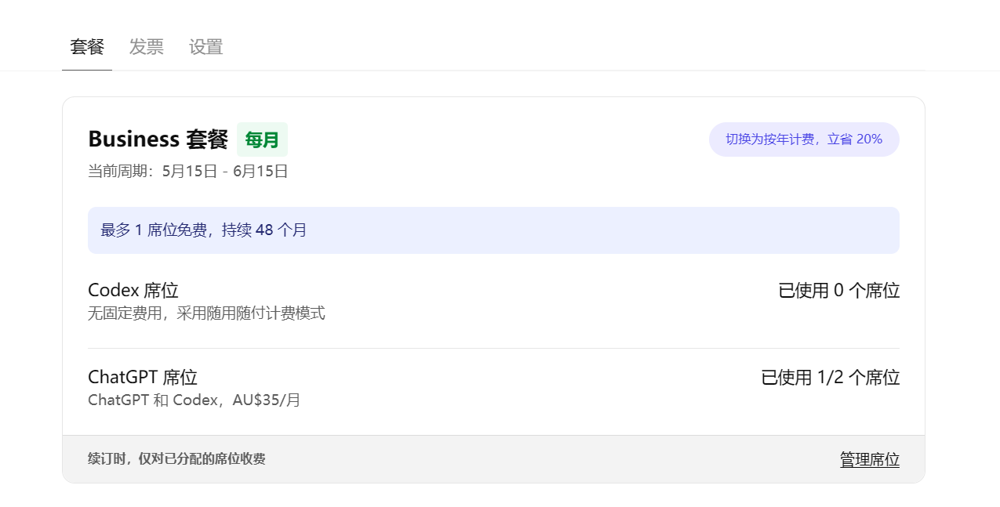

# 这两天获取 GPT Coding Plan 的尝试复盘

> 记录时间：2026-05-18  
> 目标：在国区无法直接订阅、官方价格偏高的情况下，寻找更低成本获得适合 coding 使用的 ChatGPT 会员方案。  
> 说明：本文是个人折腾复盘，优惠活动、支付规则、地区限制和账号风控都可能变化，最终以官方页面和实际支付结果为准。

**后续本项目会持续更新 GPT 官方活动指南**，请关注。

2025/05/22 法国节点   https://chatgpt.com/?promoCode=thinkiafr
2025/05/25 墨西哥节点 https://chatgpt.com/?promoCode=thinkiamx
## 一、背景与目标

国区目前无法直接订阅 OpenAI 的 coding plan 相关计划，且标准价格偏高。我的核心诉求不是单纯获得 ChatGPT Plus，而是希望低价拿到更适合 coding 工作流的账号能力，尤其是：

- 有 Skill 功能；
- 有 Pro 模式或更接近高阶计划的能力；
- Codex / coding 相关额度足够；
- 成本尽量低，流程尽量可复用。

围绕这个目标，我主要尝试了两条路径：

1. 土区 Apple 账号 + 礼品卡，低价订阅 Plus；
2. 寻找 ChatGPT 官方活动优惠码，低价开通 Business / Team 类计划。

## 二、两条路径的结论对比

| 路径 | 成本 | 稳定性 | 难度 | 功能匹配度 | 我的结论 |
| --- | ---: | --- | --- | --- | --- |
| 土区 Apple 账号 + 礼品卡订阅 Plus | 约 80 元 / 月 | 较稳定 | 中等 | 一般 | 能稳定拿到 Plus，但没有 Skill、没有 Pro 模式，用起来不够顺手 |
| 官方活动优惠码订阅 Business / Team | 取决于活动，如两个月免费、低价买一送一 | 较稳定 | 较高 | 高 | 功能最符合需求，但优惠码窗口期短，支付是主要难点 |

一句话总结：  
**土区 Plus 是稳定备胎，官方活动 Business 是更符合我 coding 需求的目标方案。**

## 三、尝试 1：土区 Apple 账号 + 礼品卡订阅 Plus

### 需要准备

- 一个邮箱，推荐 Gmail；
- 一台 Apple 手机；
- 可用于 Apple / App Store 环境的梯子，例如 Shadowrocket；
- 土区 Apple 账号；
- 里拉充值礼品卡。

### 大致流程

1. 用 Gmail 注册土区 Apple 账号；
2. 购买土耳其里拉 Apple 礼品卡；
3. 在 Apple 账号中充值礼品卡余额；
4. 在 App Store 登录土区 Apple 账号；
5. 重新下载 ChatGPT；
6. 登录自己的 ChatGPT 账号；
7. 在 iOS 端看到 499 里拉的 Plus 付款选项；
8. 使用 Apple 余额完成订阅。

### 关键注意事项

- 土区 Apple 账号注册流程可以参考网上现成教程；
- 如果付款方式没有出现 `None`，原因和解决办法记录在 [apple 土区账号问题.md](apple 土区账号问题.md)；
- App Store 登录土区账号后，需要重新下载 ChatGPT，之后再登录自己的 ChatGPT 账号，才更容易看到土区里拉价格。

### 结果评价

这个方法比较稳定，如果过程顺利，大概 1 小时可以完成订阅。它的主要优点简单、可重复、路径清晰。

但问题也很明显：Plus 目前不符合我的核心需求。它暂时没有 Skill 功能，也没有 Pro 模式，虽然 Codex 额度可能比 Business 更高，但整体 coding 工作流不如 Business / Team 类账号顺手。

所以这条路适合作为低价 Plus 备选方案，不是我的最终目标。

## 四、尝试 2：寻找官方活动优惠码订阅 Business / Team

### 需要准备

- 一个仍然有效的官方优惠码；
- 能刷出对应活动页面的梯子；
- 能完成国际支付的银行卡；
- 最好能拿到 Stripe 长链接，降低购买失败和风控概率。

### 大致流程

1. 找到某个国家或地区的官方优惠码；
2. 切换到对应地区的网络环境；
3. 打开对应优惠活动页面，刷出购买入口；
4. 尝试获取 Stripe Checkout 长链接；
5. 如果直接获取失败，基于已有长链接或 checkout payload 修改关键字段；
6. 输入可用银行卡完成支付。

### 难点 1：优惠码很难找，而且失效很快

官方活动的窗口期通常很短，经常几天就失效。这里最大的难点不是技术流程，而是信息速度。

我目前找到优惠码的主要来源是 X 或 GitHub 上的这个项目：

- `JUk1-GH/gpt-promo-scanner`

这个项目能帮助扫描和发现为数不多还可用的官方优惠码。后续如果继续走这条路，关键是尽快发现、尽快验证、尽快支付。

### 难点 2：Stripe 长链接不一定能顺利拿到

打开 F12 后，可能遇到几类问题：

- 长链接获取失败；
- 弹出的长链接不是优惠后的价格；
- 页面能看到优惠，但 checkout 链接没有正确带上优惠信息；
- 地区、货币、优惠码之间不匹配。

目前比较关键的思路是：生成或修改 checkout payload 时，重点检查下面三处。

```js
const COUPON = "你的优惠码";

const payload = {
  billing_details: {
    country: "US",
    currency: "对应货币缩写"
  },
  cancel_url: "https://chatgpt.com/?promoCode=你的优惠码",
  promo_code: COUPON
};
```

需要重点修改：

- `const COUPON = "XXX"`：改成当前优惠码；
- `billing_details.currency`：改成优惠码对应地区的货币缩写；
- `cancel_url`：改成对应优惠码地址，确保优惠码信息被带回页面。

完整脚本的价值不在于代码本身，而在于确认 checkout 请求里的优惠码、货币、地区和返回链接是一组匹配参数。

### 难点 3：支付银行卡是最后一道门槛

我最开始尝试使用国内 Visa 卡，但支付被拒。后来考虑绑定 Google Pay，但这种方式在安卓手机里通常只能按官方价格订阅，无法享受活动优惠，所以没有解决核心问题。

最后可行的方式是开通虚拟卡完成支付。一个低门槛路径是通过 Bitget 等平台注册银行卡，具体教程可以在 YouTube 搜索。对国内用户来说，这条路相对可操作。<u>Bitget 推荐码 pffbPMEc，注意大小写</u>

### 结果评价

尝试 2 最大的问题是不可控：

- 优惠码难找；
- 优惠码失效快；
- 梯子和优惠码地区要匹配；
- 长链接可能获取失败；
- 国内银行卡经常无法支付；
- 虚拟卡也可能产生额外费用或风控。

这条路的功能匹配度跟我最高，因为 Business / Team 类账号更接近我想要的 coding 工作流：有 Skill、有更完整的工作区能力，也更适合日常开发使用。最终拿下 **48 个月的买一送一活动**，相当于 65 多一个月，而且是 **月付**（注意不要选年付，优惠没有多），如果后面有更优惠的活动，还可以停止续费。



## 五、当前判断

这两天的折腾说明：

- 如果只想低价拿 Plus，土区 Apple 礼品卡路线可行，稳定性较高；
- 如果想要更适合 coding 的体验，应该优先盯官方 Business / Team 活动；
- 最实际的准备动作是：保留土区 Plus 路线作为备选，同时提前准备虚拟卡和优惠码扫描渠道。

## **如果觉得本文有帮助，但暂时没有对应优惠码，请持续关注，找到优惠码会立刻贴上来**

## 六、风险和提醒

- 官方活动可能随时结束，优惠码也可能随时失效；
- 任何地区、支付、礼品卡、虚拟卡方案都可能遇到风控；
- 不同账号可能看到不同价格和订阅入口；
- **长链接价格必须在支付前核对**，不能只看脚本输出；
- 订阅前要确认实际计划名称、席位数量、计费周期和续费价格；
- 虚拟卡可能有开卡费、充值费、汇率损耗或支付失败风险。

这次折腾的核心收获是：  
**便宜方案不难找，难的是便宜、稳定、功能匹配三者同时成立。**
